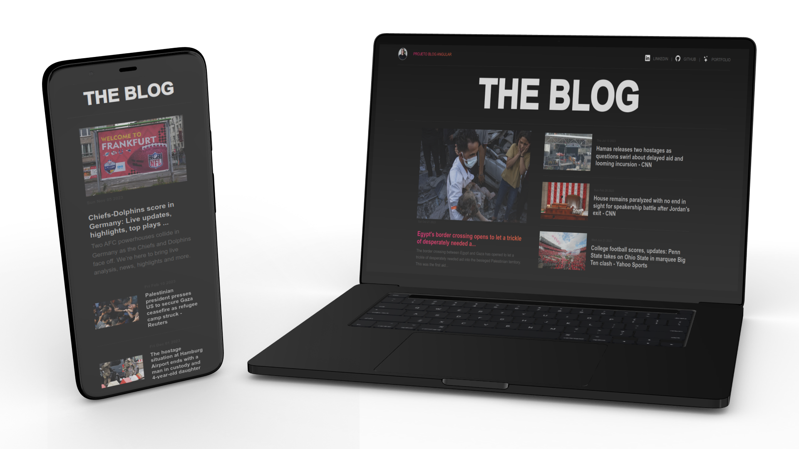

<h1 align="center">
  

  BLOG ANGULAR
</h1>

  <a href="#bookmark-sobre">Sobre</a>&nbsp;&nbsp;&nbsp;|&nbsp;&nbsp;&nbsp;
  <a href="#rocket-tecnologias">Tecnologias</a>&nbsp;&nbsp;&nbsp;|&nbsp;&nbsp;&nbsp;
  <a href="#paintbrush-layout">Layout</a>&nbsp;&nbsp;&nbsp;|&nbsp;&nbsp;&nbsp;
  <a href="https://blog-angular-andre-horman.vercel.app/" target="_blank">Aplicação na Vercel</a>

  

## :bookmark: Sobre

O **Blog Angular** é uma aplicação Web desenvolvida em Angular, que consome a [News API](https://newsapi.org/) para exibir as principais notícias do momento. O projeto foi desenvolvido com o intuito de praticar os conceitos básicos do Angular, como componentes, diretivas, serviços, rotas, entre outros.

Para executar a aplicação, realize os passos a seguir:

* Clone o repositório ou realize um fork para o seu GitHub.
* Entre no diretório do projeto --> `cd blog-angular`.
* Instale as dependências do projeto --> `npm install`.
* Execute a aplicação --> `ng serve`.

 

  

## :rocket: Tecnologias

  - `Angular`
  > Framework JavaScript para desenvolvimento de aplicações web.
  - `TypeScript`
  > Linguagem de programação que adiciona tipagem estática ao JavaScript.
	- `News API`
	> API que fornece notícias de diversas fontes e em diversos idiomas.
  - `Vercel`
  > Plataforma de hospedagem voltada para aplicações web modernas e escaláveis.

## :paintbrush: Layout

Inspirei-me no [Layout](https://dribbble.com/shots/18089191-Blog-Layout?utm_source=Clipboard_Shot&utm_campaign=dwinawan&utm_content=Blog%20Layout&utm_medium=Social_Share&utm_source=Clipboard_Shot&utm_campaign=dwinawan&utm_content=Blog%20Layout&utm_medium=Social_Share) criado por **Dwinawan** para orientar o meu projeto.

---
